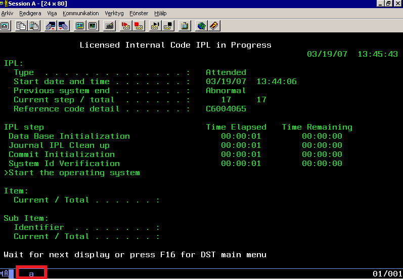

# AS400 Interface
This package provides interface with AS400 session. Below image shows AS400 window (Image Credit: Wikipedia)

All the communication done over PCOMM (Personal Communication COMM) technology. Host Access Class Library provides nice guide for the same.



# Usage
AS400 instance can be created as below,

``` python
from ibm import Instance

# session "A" is marked in above image with Red box
instance = Instance("A")
```
out of the box two pointer are available, ps and oia pointers.

``` text
PS(Presentation Space): provides methods and properties to query and manipulate the AS400 screen objects for the related created instance.
```

``` text
OIA(Operator Information Area): it provides methods and properties to query and manipulate the Operator Information Area, bottom bar.
```

simple program can be created out of the created instance.

From the above base, more useful utility class is provided, its usage is below,

``` python
from ibm import Instance

instance = Instance(session='A')
print(instance.gettext(row=4, column=2, length=3))
# "IPL"
instance.wait(1)
# block execution for 1 second
instance.sendkeys(key='[pf16]')
# above command send F16 key press and window get change
```

``` python
from ibm import Instance, Screen

instance = Instance("A")
screen = Screen(instance)

screen.describe("cursor", x=1, y=3)
screen.wait(5)
# wait up to 5 second for cursor to appear at (1, 3) location.
# As soon as cursor appears, it returns True else after time out returns False

text = Screen(instance)
text.describe(x=3, y=1, string="IPL", case=True)
text.wait(5)
# wait up to 5 second for IPL (case sensitive) appear at (3, 1) location.
# As soon as "IPL" appears, it returns True else after time out returns False
```
